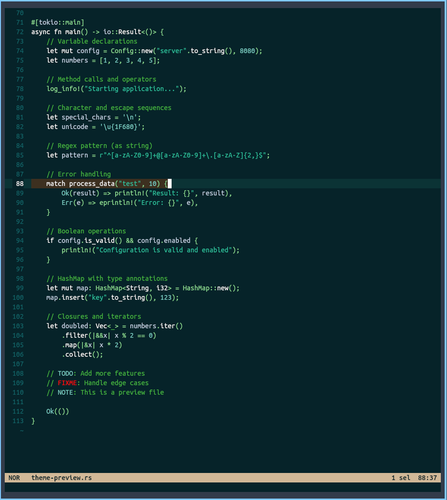

# Theme Grass (helix)



## Configuration

Place the `grass.toml` file to your helix themes folder, generally `$XDG_CONFIG/helix/themes`.

Then you can issue the `:theme grass` command or set

```toml
# $XDG_CONFIG/helix/config.toml
theme = "grass"
```

to your helix `config.toml` file.

This theme inspired by:
- Jonathan Blow's livestreams

## Thanks

- [naysayer-theme.el](https://github.com/nickav/naysayer-theme.el)

## License

Grass is licensed under the MIT License.
